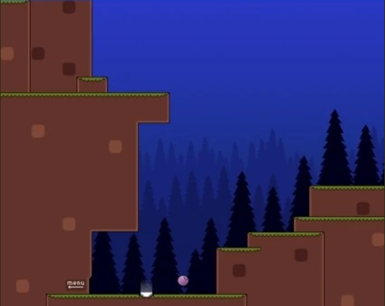

I had been searching for this game for a decade—maybe even longer—until I finally stumbled upon it yesterday.

Why? Is it something special? Is it that good? I don’t know. But I kept coming back to this game in my memories from time to time. For me, it’s a special masterpiece.

When I look at screenshots or play the game, I’m filled with a strange, fake nostalgia for a non-existent past. Don’t get me wrong—it’s not about who I was back then or what the world was like. When I feel nostalgic about games, it’s simply about the games themselves. They create a feeling, and from that feeling, an entire world is born.

That’s what I think about... but enough words. Try it—or don’t.

Made by [Nifflas](https://nifflas.itch.io/)

[`Download`](https://archive.org/details/Within_a_Deep_Forest/) it here from the [Internet Archive](https://archive.org/details/Within_a_Deep_Forest/)

Check out the [Game Wiki](https://nifflas.fandom.com/wiki/Within_a_Deep_Forest) for secrets , plot summary and list of unlockable balls

