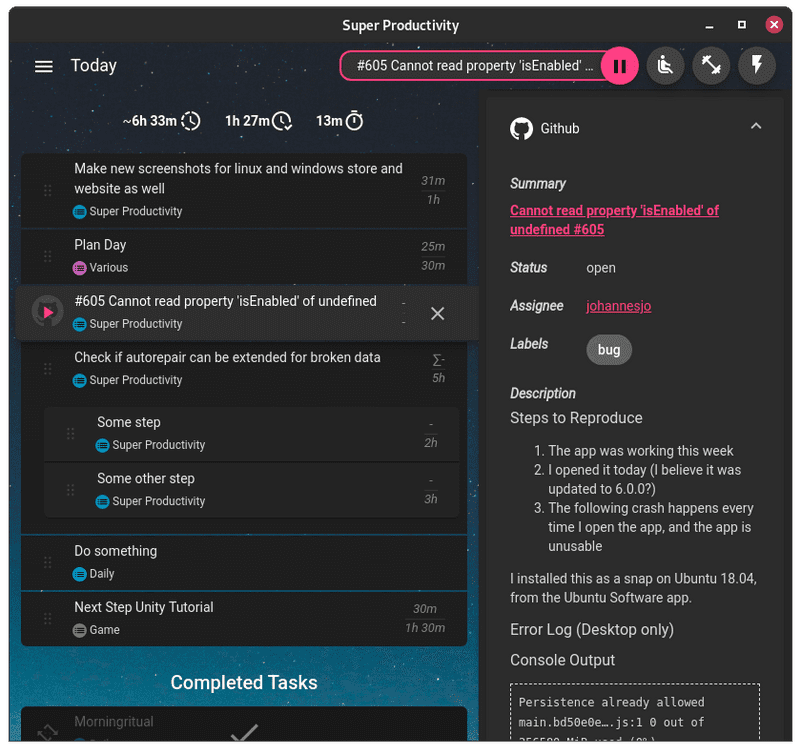

Super Productivity has become my go-to app for staying organized and on track. I can easily track birthdays, create to-do lists for everything from movies I want to watch to things I need to buy, and much more. But what I love most is the ability to schedule tasks and set reminders. It’s exactly what I was looking for!

Although I don’t use all the features, Super Productivity has some excellent extras like Pomodoro timers, focus mode, time tracking, and support for syncing with Dropbox, WebDAV, or local files. It gives you all the tools you need to stay on top of things, even if you’re not using every single feature.

Official site:<b> [https://super-productivity.com/](https://super-productivity.com/)</b>




## Arch linux
```
git clone https://aur.archlinux.org/superproductivity-bin.git
cd superproductivity-bin
makepkg -si
```
## Flatpak
### Install
```
flatpak install flathub com.super_productivity.SuperProductivity
```
### Run
```
flatpak run com.super_productivity.SuperProductivity
```

## Android

Get it from
[Google Play](https://play.google.com/store/apps/details?id=com.superproductivity.superproductivity)

## Sync Android and PC with Dropbox

If you want to sync your tasks between your Android phone and PC, follow these steps:

### On the PC App
*  Go to Settings → Sync & Export.
*  Enable Syncing and, if you want, enable Compression for faster syncing.
*  Set the Sync Provider to Dropbox. This will redirect you to Dropbox in your browser.
*  Create a Dropbox account (if you don’t have one) and copy the code from Dropbox.
*  Paste that code into your Super Productivity app. You’re all set!

### On the Mobile App
*  Repeat the same process as on your PC. Choose which data to keep (remote from your PC or local from your phone).
*  Your devices should sync automatically based on your set interval, but you can always sync manually by clicking the icon at the top right corner.

That’s it! You’re ready to sync between your Android and PC and keep everything organized.
