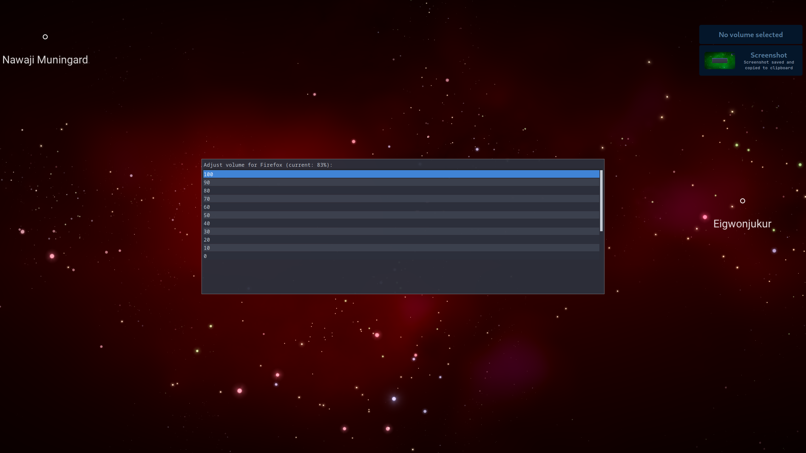

I was looking for a Linux alternative to the Win + G shortcut in Windows, which opens the Xbox Game Bar. I used this feature for quickly and conveniently managing audio, but there was nothing similar on Linux. So, I created this script to fill the gap.

This script was primarily created for the `bspwm`  tiling window manager but might work with some tweaks on other window managers.

# Steps to Use

## Keybind

Edit your keyboard shortcuts in the `sxhkdrc` file, located at  `.config/bspwm/`.

Example:

```
# Audio management durign gameplay
super + g
	~/.config/bspwm/src/Audio_manager
```
## Script

Place the script below in your `bspwm` script folder (e.g., `.config/bspwm/src/` ) and name it  `Audio_manager`

```
#!/usr/bin/env bash

# Get a list of active audio streams and their application names, excluding anything starting with "sink-input"
streams=$(pactl list sink-inputs | awk '
  /Sink Input #[0-9]+/ {stream_id = $3}
  /application.name/ {
    app_name = substr($0, index($0,$3))
    gsub(/"/, "", app_name)

    if (app_name !~ /^sink-input/) {
      stream_list[app_name] = stream_id
    }
  }
  END {
    for (app_name in stream_list) {
      print stream_list[app_name], app_name
    }
  }
')

# If no streams are found, show a message
if [[ -z "$streams" ]]; then
    notify-send "No audio streams found"
    exit 1
fi

# Show the list of audio streams in rofi
selected=$(echo "$streams" | rofi -dmenu -i -p "Select Application to Adjust Volume" -no-background -float)

# Debugging: Print the selected stream
echo "Selected: $selected"

# Extract stream ID and app name from the selected entry
# Remove the leading '#' from the stream ID
stream_id=$(echo "$selected" | awk '{print $1}' | sed 's/#//')
app_name=$(echo "$selected" | awk '{print $2}')

# Check if an application was selected
if [[ -z "$stream_id" ]]; then
    notify-send "No application selected"
    exit 1
fi

# Get current volume level of the selected application
current_volume=$(pactl list sink-inputs | grep -A 10 "Sink Input #$stream_id" | grep 'Volume' | awk '{print $5}' | sed 's/%//')

# Show volume selection in rofi
new_volume=$(echo -e "100\n90\n80\n70\n60\n50\n40\n30\n20\n10\n0" | rofi -dmenu -i -p "Adjust volume for $app_name (current: $current_volume%)" -no-background -float)

# If no new volume is selected, exit
if [[ -z "$new_volume" ]]; then
    notify-send "No volume selected"
    exit 1
fi

# Adjust the volume using pactl
pactl set-sink-input-volume "$stream_id" "$new_volume%"

# Notify the user of the volume change
notify-send "Set volume for $app_name to $new_volume%"
```
  
